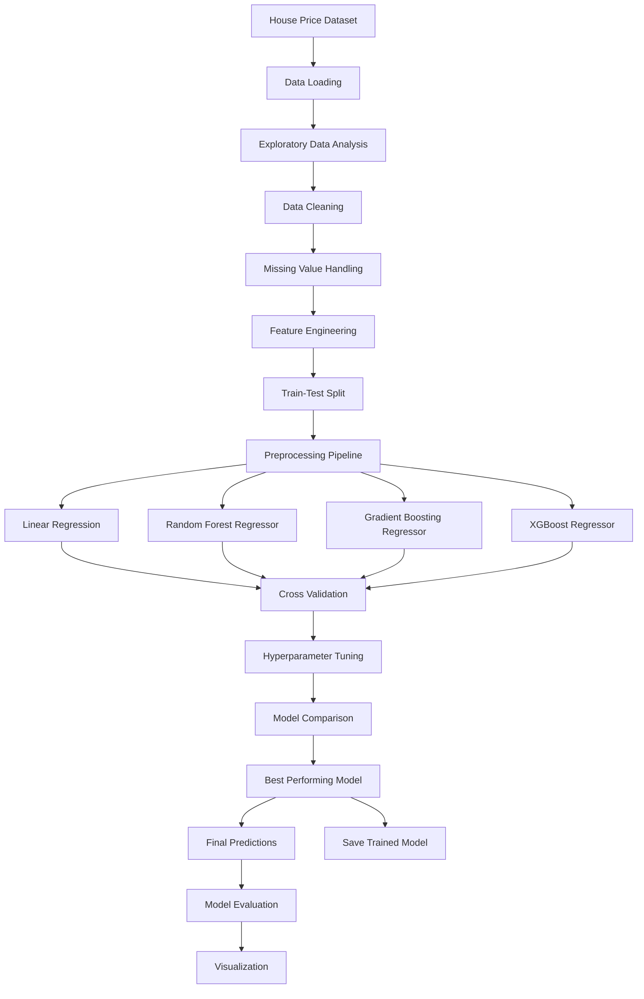

# House Price Prediction using ML

An end-to-end machine learning project for predicting residential house prices using data preprocessing, exploratory data analysis, feature engineering, multiple regression algorithms, hyperparameter tuning, and model evaluation.

---

## Project Overview

House prices are influenced by several factors such as property size, location, construction quality, number of rooms, garage capacity, and other property characteristics.

This project develops a machine learning system that learns patterns from historical housing data and predicts the sale price of previously unseen properties.

The project follows a complete machine learning workflow:

**Data Collection → Data Preprocessing → Exploratory Data Analysis → Feature Engineering → Model Training → Hyperparameter Tuning → Evaluation → Prediction**

---

## Objectives

* Analyze a real-world house price dataset
* Perform exploratory data analysis
* Handle missing and inconsistent data
* Process numerical and categorical features
* Perform feature engineering
* Train multiple machine learning regression models
* Compare model performance
* Perform cross-validation
* Optimize model hyperparameters
* Identify important features
* Select the final model
* Predict house prices for unseen data
* Visualize prediction performance

---

## System Architecture



---

## Machine Learning Workflow

```text
                    House Price Dataset
                            |
                            v
                    Data Exploration
                            |
                            v
                    Data Preprocessing
                 +----------+----------+
                 |          |          |
            Missing      Encoding    Scaling
             Values
                 |          |          |
                 +----------+----------+
                            |
                            v
                    Feature Engineering
                            |
                            v
                     Train-Test Split
                            |
             +--------------+--------------+
             |              |              |
             v              v              v
       Random Forest   Gradient Boosting   XGBoost
             |              |              |
             +--------------+--------------+
                            |
                            v
                    Cross Validation
                            |
                            v
                  Hyperparameter Tuning
                            |
                            v
                    Model Comparison
                            |
                            v
                     Final Model
                            |
                            v
                    Price Prediction
                            |
                            v
                    Model Evaluation
```

---

## Dataset

The project uses the Ames Housing Dataset, which contains detailed information about residential properties and their corresponding sale prices.

### Target Variable

```text
SalePrice
```

The target variable represents the final sale price of each property.

### Important Features

| Feature      | Description                         |
| ------------ | ----------------------------------- |
| OverallQual  | Overall material and finish quality |
| GrLivArea    | Above-ground living area            |
| GarageCars   | Garage capacity                     |
| GarageArea   | Garage size                         |
| TotalBsmtSF  | Total basement area                 |
| 1stFlrSF     | First-floor area                    |
| YearBuilt    | Original construction year          |
| FullBath     | Number of full bathrooms            |
| BedroomAbvGr | Number of bedrooms above ground     |
| Neighborhood | Location of the property            |
| LotArea      | Lot size                            |

The dataset contains both numerical and categorical features, making it suitable for demonstrating realistic machine learning preprocessing.

---

## Data Preprocessing

The preprocessing pipeline includes the following stages.

### Missing Value Handling

Missing values are identified and handled using appropriate statistical or domain-based strategies.

### Categorical Encoding

Categorical variables are transformed into numerical representations using techniques such as One-Hot Encoding.

### Numerical Feature Processing

Numerical variables are cleaned and transformed where required.

### Feature Scaling

Scaling is applied to appropriate numerical features when required by the selected algorithms.

### Feature Engineering

Additional meaningful features may be derived from existing variables to improve predictive performance.

### Train-Test Split

The dataset is divided into:

```text
80% Training Data
20% Testing Data
```

The testing data remains unseen during model training.

---

## Machine Learning Models

Multiple regression algorithms are trained and compared.

### Linear Regression

Used as a baseline regression model.

### Random Forest Regressor

An ensemble learning algorithm that combines multiple decision trees and can model nonlinear relationships.

### Gradient Boosting Regressor

Builds an ensemble sequentially, with each new model attempting to reduce the errors of previous models.

### XGBoost Regressor

An optimized gradient boosting algorithm designed for high-performance learning on structured and tabular datasets.

---

## Model Development Pipeline

```text
Training Data
      |
      v
Preprocessing
      |
      v
Feature Transformation
      |
      v
Model Training
      |
      v
Cross Validation
      |
      v
Hyperparameter Tuning
      |
      v
Model Evaluation
      |
      v
Final Model
```

---

## Model Evaluation

This is a regression problem, so conventional classification accuracy is not used as the primary evaluation metric.

The following metrics are used.

### Mean Absolute Error (MAE)

Measures the average absolute difference between actual and predicted house prices.

Lower MAE indicates smaller prediction errors.

### Root Mean Squared Error (RMSE)

Measures prediction error while giving greater weight to larger errors.

Lower RMSE indicates better performance.

### R² Score

Measures how much of the variation in house prices is explained by the model.

Higher R² indicates better model performance.

---

## Model Comparison

The final results will be added after model training and hyperparameter tuning.

| Model             | MAE | RMSE | R² Score |
| ----------------- | --: | ---: | -------: |
| Linear Regression | TBD |  TBD |      TBD |
| Random Forest     | TBD |  TBD |      TBD |
| Gradient Boosting | TBD |  TBD |      TBD |
| XGBoost           | TBD |  TBD |      TBD |

Results will be updated using the actual test-set performance obtained during experimentation.

---

## Visualizations

The project will generate visualizations for both data analysis and model evaluation.

### Exploratory Data Analysis

* Target variable distribution
* Numerical feature distributions
* Correlation heatmap
* Feature relationships
* Outlier analysis

### Model Evaluation

* Actual vs Predicted Prices
* Prediction Error Distribution
* Residual Analysis
* Model Performance Comparison
* Feature Importance

---

## Feature Importance

Tree-based models such as Random Forest and XGBoost can provide feature importance information.

This analysis helps identify which property characteristics contribute most strongly to the model's predictions.

Potentially important factors include:

* Overall quality
* Living area
* Garage capacity
* Basement area
* Location
* Construction year

---

## Project Structure

```text
House-Price-Prediction-ML/
|
├── data/
│   └── train.csv
|
├── notebooks/
│   └── house_price_analysis.ipynb
|
├── src/
│   ├── data_preprocessing.py
│   ├── model_training.py
│   ├── model_evaluation.py
│   └── predict.py
|
├── models/
│   └── best_model.pkl
|
├── results/
│   ├── correlation_heatmap.png
│   ├── model_comparison.png
│   ├── actual_vs_predicted.png
│   └── feature_importance.png
|
├── requirements.txt
├── README.md
└── .gitignore
```

---

## Technologies Used

### Programming Language

* Python

### Data Processing

* Pandas
* NumPy

### Machine Learning

* Scikit-learn
* XGBoost

### Visualization

* Matplotlib
* Seaborn

### Development Tools

* VS Code
* Jupyter Notebook
* Git
* GitHub

---

## Installation

Clone the repository:

```bash
git clone https://github.com/gamana29/House-Price-Prediction-ML.git
```

Navigate to the project directory:

```bash
cd House-Price-Prediction-ML
```

Install the required dependencies:

```bash
pip install -r requirements.txt
```

---

## Running the Project

The project will be executed through the following stages.

### Data Preprocessing

```bash
python src/data_preprocessing.py
```

### Model Training

```bash
python src/model_training.py
```

### Model Evaluation

```bash
python src/model_evaluation.py
```

### Prediction

```bash
python src/predict.py
```

The commands will be finalized as the project implementation is completed.

---

## Future Improvements

Possible future enhancements include:

* Advanced feature engineering
* Automated hyperparameter optimization
* Ensemble stacking
* SHAP-based explainable AI
* Interactive Streamlit interface
* REST API for predictions
* Cloud deployment
* Model monitoring
* Real-time prediction service

---


## Author

**Gamana Chirumamilla**

B.Tech ECE | 5G/6G Wireless Technologies

GitHub: [@gamana29](https://github.com/gamana29)

---


This project is developed for educational and portfolio purposes.
